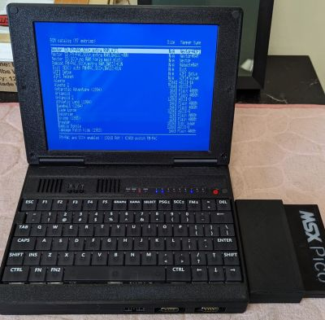

# Msxbook external slot 2 adapter

You are welcome to make and sell the adapter to the MSX community if you agree not to change the original files. 
Don't add new text or logos... don't change anything at all and it is all good.

Parts List:

-Main PCB:\
-- F1: 125ma to 375ma fuse (-12v line) (optional but recomended)\
-- F2: 800ma to 1A fuse (+5v line) (optional but recomended)\
-- F3: 400ma to 500ma fuse (+12v line) (optional but recomended)\
-- J1: 2x25 right angle pin header\
-- J2: 50 pin right angle male SCSI connector

-External PCB:\
-- C1: 100uf to 220uf 25v (optional)\
-- C2: 100uf to 220uf 25v (optional)\
-- C3: 220uf to 470uf 16v (optional)\
-- J1: 50 pin right angle edge connector\
-- J2: 50 pin right angle female SCSI connector

-3D brackets: (The dimentions below are critical. Get the correct ones.)\
--Screws are M2.5 x 5mm\
--Inserts are M2.5 x 2.5 x 3.5 

-Parts Link:\
https://a.aliexpress.com/_mOBWXzN \
https://www.aliexpress.us/item/2255800960638500.html (option: 2X25 50PIN) \
https://www.aliexpress.com/item/3256808357131162.html (option: M2.5x2.5x3.5) \
SCSI connectors: single or pack \
https://www.aliexpress.us/item/3256807779614080.html (option: 50 pin curved female and 50 pin curved male) \
https://a.aliexpress.com/_mt0LCd1 (option: 50 pin curved female and 50 pin curved male) \

Tips and tricks:\
*** When soldering the EDGE connector, make sure the distance between the PCB and the connector is between 2mm and 3mm. \
*** The distance between the bottom the main PCB and the top ot the angled pin header is 7.3mm \
*** Make sure the angled pin header and EDGE connectors are at a nice 90°. Start by solderins pins 1, 2 and 49, 50 and then do a fit test. \
*** To insert the pcb into the 3D cart, angle it 45° and insert the left side first ("left" when looking at inside the EDGE where the cart connects) then slide the board in, sitting it flush. \

MSX FOREVER !!!
